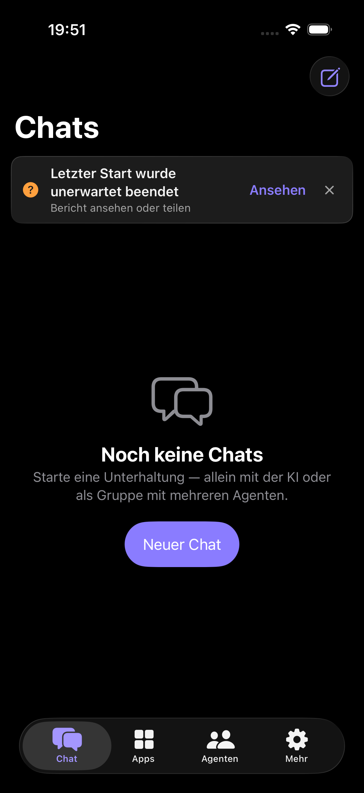
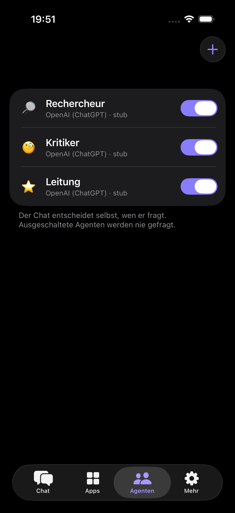
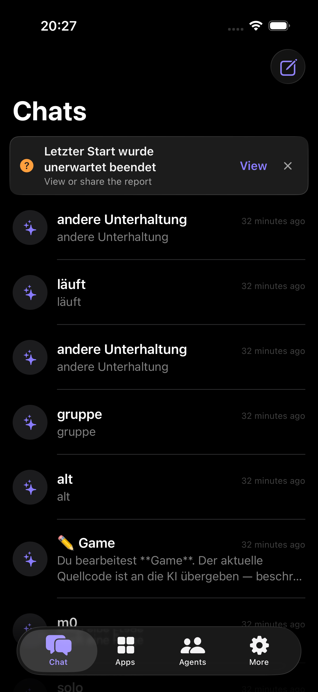
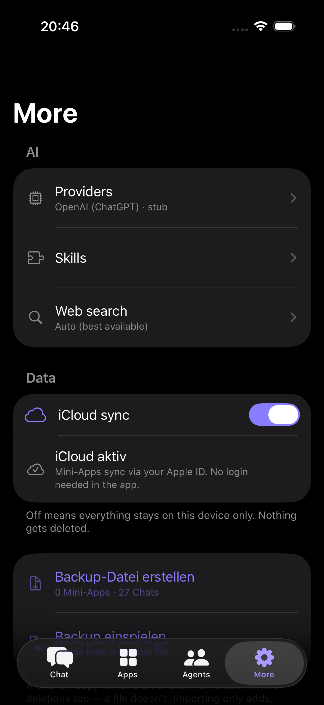

# aiity

**AI it yourself.** A native iOS chat app where you talk to AI agents — one, or
several at once — and the small tools you need get *built* in the conversation
instead of installed.

Ask for a timer that does your intervals, a converter for a recipe, a tracker
for something only you care about. It appears as a self-contained web app inside
a sandbox, usable immediately. Keep it and it lives with your apps and works
offline; don't, and it's gone.

There is no aiity server. You bring your own access — a cloud API key you
already have, your own machine on the network, or a model running on the iPhone
itself.

<p align="center">
  
  
  
  
</p>

> **Status: in development.** Not on the App Store yet. 276 unit tests, and the
> notes in [`docs/`](docs/) try to be honest about what is verified and what
> isn't — including the parts that aren't.

Ten languages: German (the source), English, Spanish, French, Portuguese,
Italian, Simplified Chinese, Japanese, Russian and Arabic.

---

## What is actually interesting here

**Agents that argue instead of monologuing.** Give an agent a name, a job and a
model; put several in one conversation. Two details make it a discussion rather
than three answers side by side. Each agent sees the others' turns *attributed
by name* rather than as its own train of thought — a chat model treats every
`assistant` message as something it said, and nobody argues with themselves. And
one agent is the lead: it speaks last, and its brief is to decide and name the
next step, not to summarise. See
[`GroupChatRunner.swift`](AIApp/Agent/GroupChatRunner.swift).

**Mini-apps are genuinely sandboxed.** Each runs in a `WKWebView` under a strict
CSP, with storage separated per app, no access to your conversations or keys,
and network only if you grant it. The hardened document is *generated around*
the model's markup rather than spliced into it — an earlier version inserted the
CSP after the first literal `<head>`, and a leading comment merely containing
that text swallowed the whole policy.

**Bring your own everything.** Anthropic, OpenAI, Google, OpenRouter, Mistral,
Groq, DeepSeek, xAI, Together — or Ollama / LM Studio / LocalAI on your own
network, or Apple MLX on the device with no network at all. Keys live in the
keychain. Requests go from the phone straight to the provider.

**It tells you when it broke.** Mehr → Diagnose reports how the last run ended —
a caught signal, iOS's own MetricKit crash diagnostic, and the events leading up
to it — and exports it in one tap. It keeps *known* and *inferred* apart: a
process cannot distinguish a crash from an out-of-memory kill after the fact, so
the report says exactly that instead of guessing.

## What it is not

Worth saying plainly before you clone it:

- **It is not a hosted service.** There is no backend, no account, no sync of
  your conversations anywhere. If you have no API key and no local model, the
  app cannot answer anything.
- **It is not audited.** One adversarial review has been run over it (19
  confirmed findings, all fixed) and the security-relevant reasoning is written
  down, but that is not the same as an audit.
- **It is not finished.** It has not shipped, so nothing here has met real users
  in numbers. Expect rough edges in the places nobody has walked yet.

## Build

Needs Xcode 26 (iOS 26 SDK), [XcodeGen](https://github.com/yonaskolb/XcodeGen),
and an iOS 17+ device or simulator.

```bash
brew install xcodegen
xcodegen generate
open AIApp.xcodeproj
```

`project.yml` is the source of truth — **regenerate after adding or removing any
file**, or it silently will not be compiled. Several tests in this repo's history
quietly never ran for exactly that reason, so check the test *count*, not just
the exit code.

```bash
# unit tests
xcodebuild -project AIApp.xcodeproj -scheme AIApp \
  -destination 'platform=iOS Simulator,name=iPhone 17 Pro' \
  -skipPackagePluginValidation -skipMacroValidation \
  -only-testing:AIAppTests test

# UI tests need the stub model server
python3 tools/stub_llm_server.py 8555 &
xcodebuild ... -only-testing:AIAppUITests test
```

`-skipPackagePluginValidation -skipMacroValidation` are required (mlx-swift).
On-device models do not run in the simulator — that path needs real hardware.

Screenshots are generated, not taken by hand — against a fresh container with a
seeded roster, so no real conversation can end up in a public image and the
frames are identical on every run:

```bash
python3 tools/stub_llm_server.py 8555 &
AIITY_SHOT_LANG=en xcodebuild ... -resultBundlePath /tmp/shots.xcresult \
  -only-testing:AIAppUITests/ScreenshotTests test
xcrun xcresulttool export attachments --path /tmp/shots.xcresult --output-path /tmp/shots
```

`AIITY_SHOT_LANG` takes any of the ten locales. `AppStoreScreenshotTests` is the
same idea at store dimensions.

## Layout

| | |
|---|---|
| `AIApp/Agent/` | the turn loop, group rounds, sub-agents |
| `AIApp/Providers/` | one file per dialect: Anthropic, OpenAI-compatible, MLX |
| `AIApp/Tools/` | web search, URL fetching, agent delegation |
| `AIApp/Views/` | SwiftUI screens |
| `AIApp/Services/` | mini-app bundling and validation, diagnostics, backups |
| `AIAppLiveActivity/` | Lock Screen / Dynamic Island progress |
| `docs/` | App Store readiness, localization, design notes |

Bundle id `com.aiity.app`; URL schemes `aiity://` and `aiapp://` (the latter kept
for the OpenRouter OAuth redirect). The Xcode target is still named `AIApp`.

## Contributing

Issues and pull requests welcome — [CONTRIBUTING.md](CONTRIBUTING.md) covers what
to run before opening one, and what is likely to be declined. Three things about
this codebase are easy to trip over, and each was learned the expensive way:

1. **Every persisted `Codable` type has a hand-written decoder** using
   `decodeIfPresent`. That is not a style preference. Swift's synthesized
   decoder treats a property *with a default value* as **required**, so adding
   one field makes every stored record fail to decode — which once opened the
   app with an empty chat list on top of a full archive of real conversations.
   If you add a stored field, add it to the decoder.

2. **Never let an unreadable file be read as empty and then overwritten.** That
   one bug class was found in five separate places here. A failed decode
   quarantines the bytes; if the quarantine itself fails, writing is disabled
   rather than allowed to destroy the only copy that exists.

3. **German text is the localization key.** `Text("Chats")` resolves through
   `AIApp/Localizable.xcstrings` with no code change — but a plain
   `errorMessage = "…"` does *not*, and needs `String(localized:)`. See
   [`docs/LOCALIZATION.md`](docs/LOCALIZATION.md); 116 entries once sat in the
   catalog doing nothing for exactly this reason.

## Security

No server means no infrastructure to attack, which leaves two things that
matter: the sandbox the mini-apps run in, and what happens to your provider
keys. [SECURITY.md](SECURITY.md) says where to look, what counts as a finding,
and how to report one privately. It has not been audited, and says so there too.

## Licence

[MIT](LICENSE) — © 2026 Xianjie Zhan.

Do what you like with it, including shipping your own version. If you build
something with it I'd like to hear about it.

## Contact

<getaiityapp@gmail.com> · [aiity.de](https://aiity.de)
